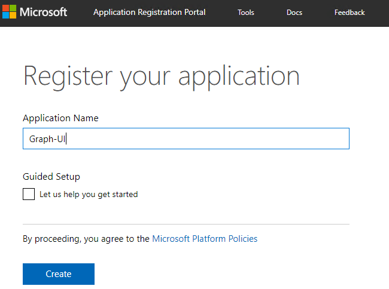
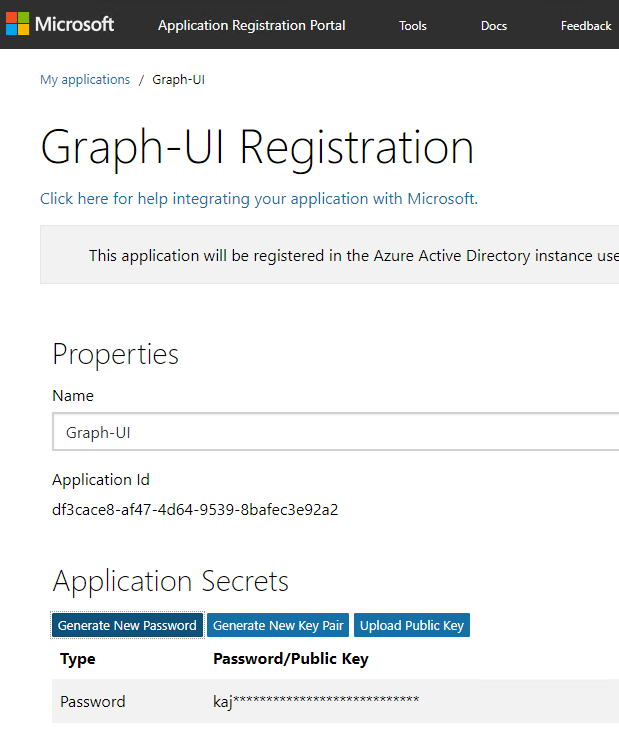
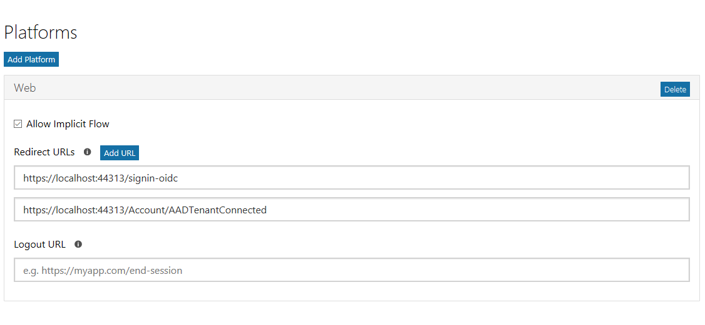
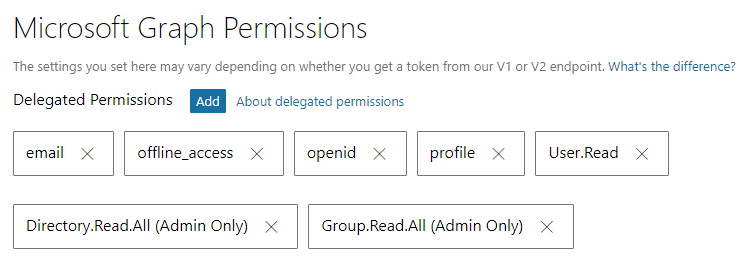

# Group Manager

The Group manager application provides functional application to manage Office 365 "unified" groups. 

[picture of the web part in action]

## Sample Details

|               Category               |                               Description                                |
| ------------------------------------ | ------------------------------------------------------------------------ |
| **Technologies Used**                | C#, JavaScript, TypeScript, Node.js, React, Adaptive Cards               |
| **[Microsoft Graph SDK(s) Used][1]** | Dotnet SDK                                            |

## Applies to

* [Microsoft Graph](https://developer.microsoft.com/en-us/graph)
* [Office 365](https://portal.office.com)

## Prerequisites

The developer workstation requires the following to build this application:

1. Registration in the [Application Registration Portal](https://apps.dev.microsoft.com).
1. Office 365 Subscription / Azure Active Directory tenant Id.
1. Administrative account for Office 365 subscription
1. Node LTS

### Register an application in the Application Registration Portal

To enable the application to call the Microsoft Graph, an application registration is required. This sample uses the [Azure Active Directory v2.0 endpoint](https://docs.microsoft.com/en-us/azure/active-directory/develop/active-directory-v2-compare).

1. Open a browser to the url **https://apps.dev.microsoft.com**
1. Log in with a Work or School account.
1. Click **Add an app**
1. Complete the **Register your application** section, entering an Application name. Clear the checkbox for Guided Setup. Click **Create**

    

1. On the registration page, in the **Application Secrets** section, click **Generate New Password**. Copy the generated password for future use.

    

1. On the registration page, in the **Platforms** section, click **Add Platform**.
1. In the **Add Platform** dialog, click **Web**.
1. Enter a **Redirect URL** for the implicit flow callback. For this sample, use the value `https://localhost:44313/signin-oidc'
1. Click the **Add URL** button.
1. Enter a **Redirect URL** for the admin consent callback. For this sample, use the value `https://localhost:44313/Account/AADTenantConnected'

    

1. Click **Save**.
1. Make note of the Application Id. This value is used in the authentication / token code.
1. Scroll down to the **Microsoft Graph Permissions** section.
1. Next to **Delegated Permissions**, click the **Add** button.
1. In the **Select Permission** dialog, scroll down and select the following Scopes:
    1. **Directory.Read.All**
    1. **email**
    1. **Group.Read.All**
    1. **offline_access**
    1. **openid**
    1. **profile**
1. Click **OK**.

    

    1. Click **Save**.

### Azure Active Directory (Azure AD) Tenant Id

The application requires the id of the tenant in which the application is registered. Use the support article [Find your Office 365 tenant ID](https://support.office.com/en-us/article/find-your-office-365-tenant-id-6891b561-a52d-4ade-9f39-b492285e2c9b) to obtain the id.

#### NodeJS

Install [NodeJS](https://nodejs.org/en/) Long Term Support (LTS) version.

- If you have NodeJS already installed please check you have the latest version using node -v. It should return the current [LTS version](https://nodejs.org/en/download/).

After installing node, make sure npm is up to date by running following command:

````shell
npm install -g npm
````

Configure Visual Studio to use the NodeJS version you installed instead of the version included in the Visual Studio install:

1. Click **Tools > Options**.
1. Expand **Projects and Solutions > Web Package Management**.
1. Click on **External Web Tools**.
1. Select the entry **$(PATH)**.
1. Click the up arrow to make this entry first in the list.


## Installation / Working Instructions

### Update application configuration

1. Open the `appSettings.json` file.
1. Update the following properties, specifying the values from the app registration process.

  ```json
    "Domain": "[yourdomain.onmicrosoft.com]",
    "TenantId": "[your-tenant-id]",
    "ClientId": "[your-client-id]",
  ```

1. In **Solution Explorer**, right-click on the project file.
1. Select **Manage User Secrets**.
1. In the `secrets.json` file, add the following properties.

  ```json
  {
    "AzureAd": {
      "ClientSecret": "[your-client-id]"
    }
  }
  ```

### Provide administrative consent to application

1. Run the application.
1. When prompted, log in with your Work or School account and grant consent to the application.
1. Navigate to the **/Account/PermissionsRequired** page.
1. Reading Groups from the tenant requires administrative consent, and must be performed via a specific endpoint. Click the **Connect your tenant** link.
1. Log in with an account that has administrative privileges in the tenant.
1. On the administrative consent dialog, click **Accept**.
1. The app will then display the Home page.

## Contributors

| Roles  |           Author(s)           |
| ------ | ----------------------------- |
| Author | Paul Schaeflein (Microsoft MVP - Office Development) @paulschaeflein |

## Version history

| Version |      Date       |    Comments     |
| ------- | --------------- | --------------- |
| 0.8     | July 3, 2018    | Demonstrated at MS Graph Community Call|


[1]: https://www.nuget.org/packages/Microsoft.Graph